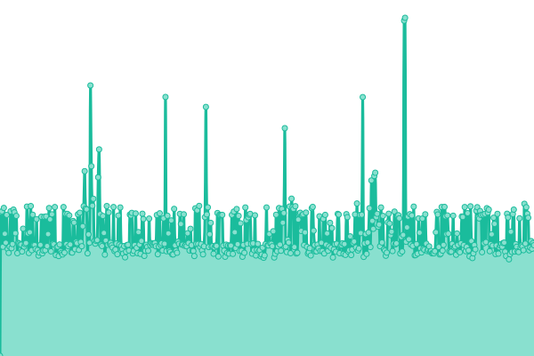
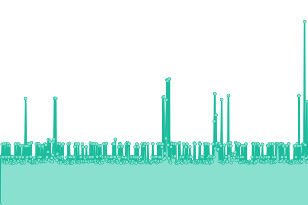
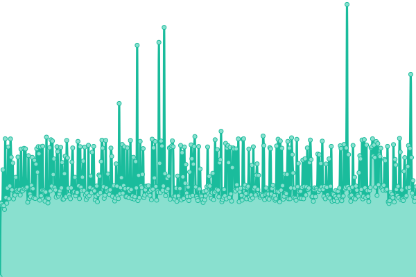

# [📈 Live Status](https://status.iceeburr.dev): <!--live status--> **🟩 All systems operational**

This repository contains the open-source uptime monitor and status page for [iceeburr](https://iceeburr.dev), powered by [Upptime](https://github.com/upptime/upptime).

With [Upptime](https://upptime.js.org), you can get your own unlimited and free uptime monitor and status page, powered entirely by a GitHub repository. We use [Issues](https://github.com/iceeburr/uptime-monitor/issues) as incident reports, [Actions](https://github.com/iceeburr/uptime-monitor/actions) as uptime monitors, and [Pages](https://status.iceeburr.dev) for the status page.

<!--start: status pages-->
<!-- This summary is generated by Upptime (https://github.com/upptime/upptime) -->
<!-- Do not edit this manually, your changes will be overwritten -->
<!-- prettier-ignore -->
| URL | Status | History | Response Time | Uptime |
| --- | ------ | ------- | ------------- | ------ |
|  [iceeburr のラジオ](https://iceeburr.dev/api/status) | 🟩 Up | [iceeburr.yml](https://github.com/iceeburr/uptime-monitor/commits/HEAD/history/iceeburr.yml) | 

 914ms
     
 | 

<a href="https://status.iceeburr.dev/history/iceeburr">100.00%</a>
    

|  [Minecraft Server](play.iceeburr.dev) | 🟩 Up | [minecraft-server.yml](https://github.com/iceeburr/uptime-monitor/commits/HEAD/history/minecraft-server.yml) | 

 168ms
     
 | 

<a href="https://status.iceeburr.dev/history/minecraft-server">100.00%</a>
    

|  [VPN Service](https://veil.iceeburr.dev/dashboard) | 🟩 Up | [vpn-service.yml](https://github.com/iceeburr/uptime-monitor/commits/HEAD/history/vpn-service.yml) | 

 560ms
     
 | 

<a href="https://status.iceeburr.dev/history/vpn-service">100.00%</a>
    

<!--end: status pages-->

[**Visit our status website →**](https://status.iceeburr.dev)

## 📄 License

- Powered by: [Upptime](https://github.com/upptime/upptime)
- Code: [MIT](./LICENSE) © [Anand Chowdhary](https://anandchowdhary.com), supported by [Pabio](https://pabio.com)
- Data in the `./history` directory: [Open Database License](https://opendatacommons.org/licenses/odbl/1-0/)
